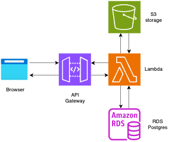

# Serverless FastAPI on AWS

## Description

    

This repository contains a FastAPI application that is designed to be deployed on AWS using Lambda functions and API Gateway. The application leverages AWS RDS for database operations and S3 for storage. This setup provides a scalable, serverless architecture for your API, allowing it to handle high loads and traffic spikes efficiently. This project is ideal for developers who are looking to deploy their FastAPI applications on AWS and want to leverage the power of serverless architecture.

## Prerequisites

- [AWS CLI](https://docs.aws.amazon.com/cli/latest/userguide/getting-started-install.html) installed and configured 
- [Terraform](https://developer.hashicorp.com/terraform/tutorials/aws-get-started/install-cli) installed

## Deployment Steps

### Setting up the environment

1. Navigate to the root directory of the project. 
2. Set up the desired values in terraform.tfvars file e.g region(aws)
3. Initialize Terraform: `terraform init`

### Deploying the aws infrastructure

1. Plan the deployment: `terraform plan`
2. Apply the plan: `terraform apply`

Upon successful deployment, the console will display the API endpoint and Lambda function name. Make a note of these values.

### Deploying API to AWS Lambda

To deploy the API to an AWS Lambda function, execute the `lambda_deploy.sh` script with the following command:

>`sh deploy.sh <app_directory> <lambda_function_name> <region>`

app_directory = api folder name _e.g api_

## API Endpoints

api swagger ui will be at - <api_endpoint>/docs

### API routes

- `POST /projects/`: Create a new project. The name, description, status, and PDF file are sent as form data.
- `GET /projects/`: Get a list of all projects.
- `GET /projects/{project_id}`: Get the details of a specific project.
- `GET /projects/{project_id}/pdf`: Download the PDF file of a specific project.
- `PUT /projects/{project_id}`: Update the details of a specific project. The name, description, status, and PDF file can be updated.
- `DELETE /projects/{project_id}`: Delete a specific project.

## Clean Up
To safely remove all resources created by Terraform, execute the following command:

`terraform destroy`